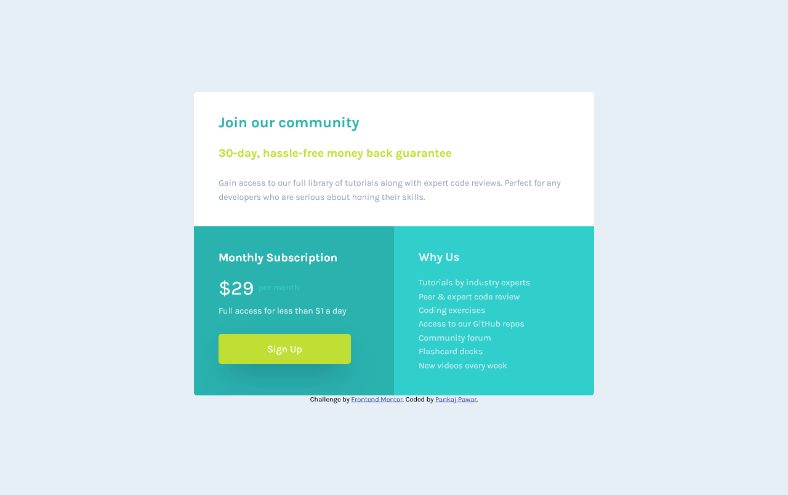

# Frontend Mentor - Single price grid component solution

This is a solution to the [Single price grid component challenge on Frontend Mentor](https://www.frontendmentor.io/challenges/single-price-grid-component-5ce41129d0ff452fec5abbbc). Frontend Mentor challenges help you improve your coding skills by building realistic projects. 

## Table of contents

- [Overview](#overview)
  - [The challenge](#the-challenge)
  - [Screenshot](#screenshot)
  - [Links](#links)
- [My process](#my-process)
  - [Built with](#built-with)
  - [What I learned](#what-i-learned)
- [Author](#author)
- [Acknowledgments](#acknowledgments)

## Overview

### The challenge

Users should be able to:

- View the optimal layout for the component depending on their device's screen size
- See a hover state on desktop for the Sign Up call-to-action

### Screenshot

### Links

- Solution URL: [Github Repo Link](https://github.com/DamnItAzriel/single-price-grid-component)
- Live Site URL: [Live Site Deployment On Vercel ](https://single-price-grid-component-red-kappa.vercel.app/)

## My process
- HTML
  - <main> (2 divs with the last div being divided into 2 divs as the webpage in design)
    - 

      - h2
      - h3
      - p
    - 

      - 

        - h3
        - p
        - p
        - button
      - 

        - h3
        - p
  - <footer>
- CSS
  - Mobile
    - reset and border-box
    - body
      - width: 325px;
      - font family and font size
      - margin: 75px auto;
      - bg color
    - main
      - bg-color
      - border-radius
    - join
      - padding, color
      - h2
        - color
        - margin
      - h3
        - color
        - margin-bottom
      - p
        - font-size
        - line-height
      - div 2
        - monthly-subscription
          - bg-color, padding
          - span
            - vertical align
            - color
            - font-size
          - h3
            - margin-bottom
          - button
            - reset
            - width:275px;
            - inherit color, border, font, cursor
            - box-shadow
            - bg-color
          - button:hover
            - bg-color
            - box-shadow
        - why-us
          - color, bg-color, padding, border-radius
          - margin-bottom, line-height
  - Desktop
    - width:650px;
    - margin:100px auto;
    - div2
      - height: auto;
      - overflow:auto;
      - monthly-subscription & why-ua
        - padding right and left:40px;
        - border-radius
        - float:left;
        - width and height
      - button:215px;

### Built with

- Semantic HTML5 markup
- CSS custom properties

### What I learned
- I learnt to use vertical align: middle; to middle different font size text in middle of the line.
- Used float to place monthly subscription and why us divs to place side by side. Needed to give width and height to make sure they are placed at aligned properly. An ddiv2 required overflow auto to incorporate the 2 subsequent divs.

## Author

- Website - [Pankaj Pawar](https://twitter.com/DamnItAzriel)
- Frontend Mentor - [@DamnItAzriel)](https://www.frontendmentor.io/profile/DamnItAzriel)
- Twitter - [@DamnItAzriel](https://twitter.com/DamnItAzriel)

## Acknowledgments

I would like to thank frontend mentors who created these challenges which provide beginners like me to practice with good projects.
